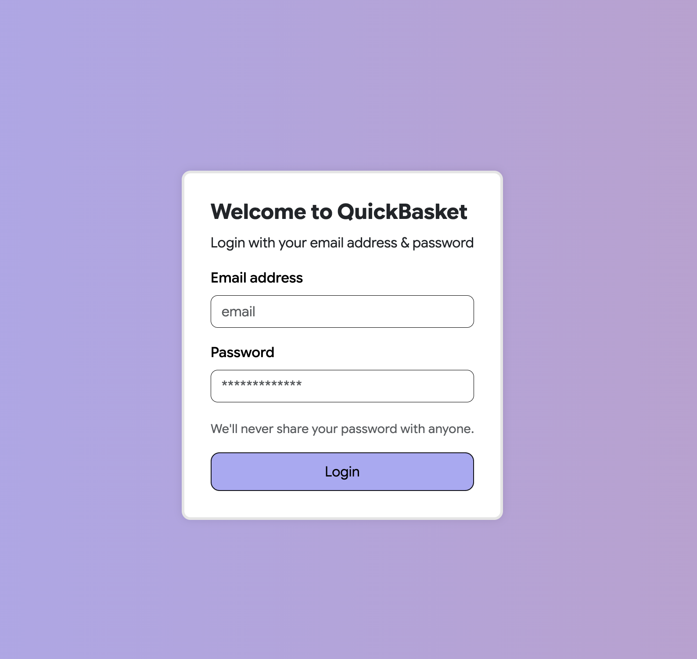
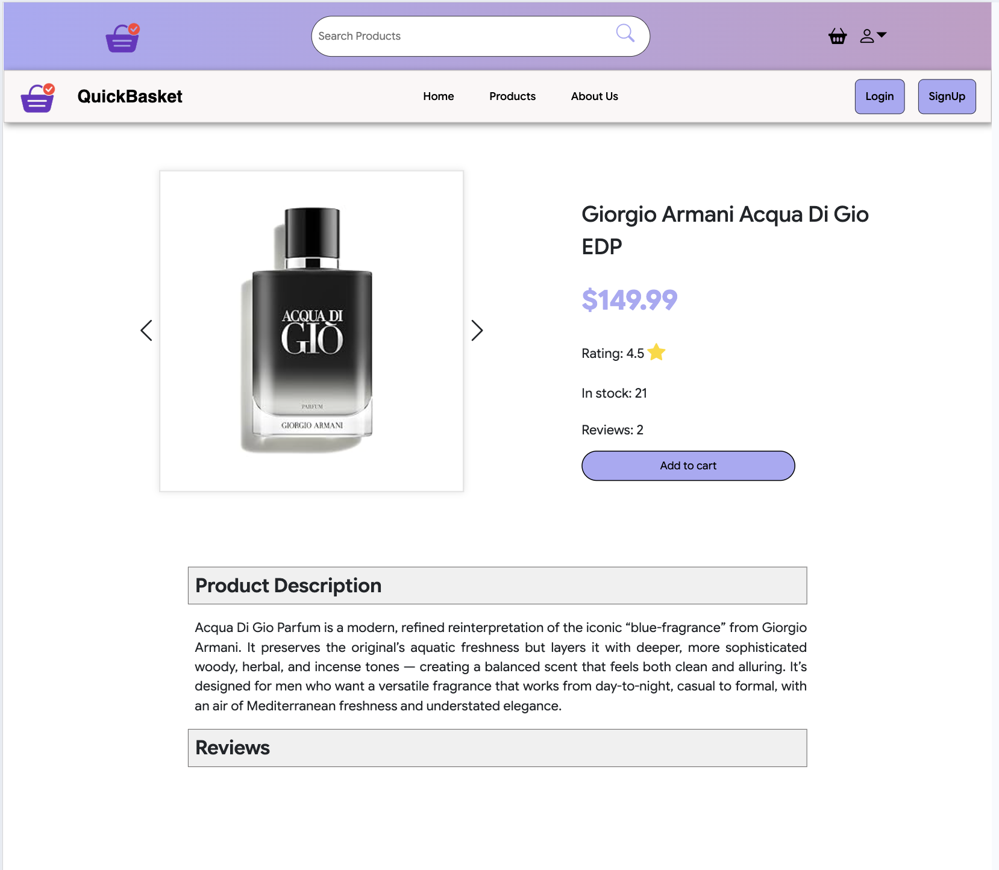
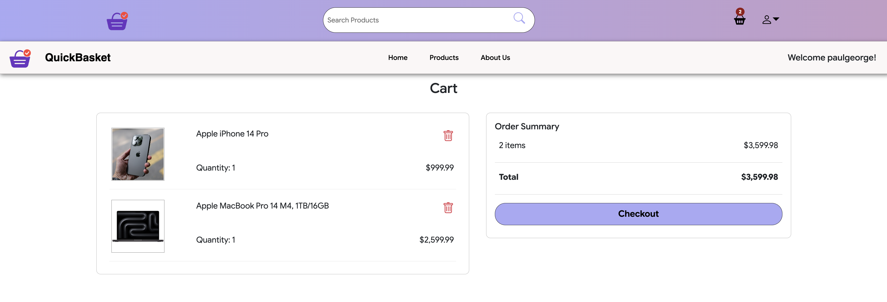

# **Quick Basket**

[](https://opensource.org/licenses/MIT)

## Project Description.
**QuickBasket** is a full-stack e-commerce application designed to deliver a fast, intuitive, and seamless online shopping experience. Users can browse products, search for products by keyword, view detailed product pages, manage their shopping cart, and securely check out.

QuickBasket features a clean UI, responsive layout, and modern web technologies to ensure a premium shopping experience across all devices.

This project was developed as a comprehensive demonstration of modern full-stack development using the MERN stack, integrating GraphQL for efficient API communication and Redux for global state management.

The front-end was developed using *React*, including the *React-Router*. The backend was developed using *Apollo Server (GraphQL)*, *Node.js* and *Express.js*. For the database, the project utilized *MongoDB* and the *Mongoose ODM*. Other packages utilized include `bcrypt`, `JWT`, `dotenv`, `jsonwebtoken`, `apollo-server-express` e.t.c. CSS was based mostly on *Bootstrap 5*, including *Bootstrap Icons*.

## Link to Webpage
Click [here](https://calm-depths-26151-e1b19dd0ae9d.herokuapp.com/)

## 📌 Features

- User Authentication & Security

- JWT-based login and signup

- Automatic session handling & token expiration detection

- Global modal that alerts users when session expires

- Product Browsing

- View all products

- Individual product detail page

- Search functionality with instant results

- Shopping Cart

- Cart persists across sessions

- Real-time price calculation

- Responsive UI

---

## 🧰 Tech Stack

| Tech | Description |
|------|-------------|
| **Frontend** | React, React Router, Bootstrap 5 |
| **Backend** | Node.js, Express.js |
| **API** | GraphQL with Apollo Server & Apollo Client |
| **Database** | MongoDB with Mongoose ODM |
| **Auth** | bcrypt, JWT |
| **Deployment** | Heroku |

---

## 📸 Screenshots

### Login


### All Products Page


### Single Product Page


### Cart Page


## 📦 Installation

To run the application locally:

### 1. Clone the Repository
```bash
git clone https://github.com/anayoifediora/QuickBasket.git
cd QuickBasket
```
### 2. Install Dependencies 
```bash
npm install
cd client && npm install
```
### 3. Environment Variables
Create a `.env` file in the root directory:
```ini
JWT_SECRET=your_jwt_secret_key
MONGODB_URI=your_mongodb_connection_string
CLOUDINARY_KEY=optional_if_using_cloudinary
```
### 4. Run the App (Development Mode)
```bash
npm run develop
```
## 📖 Usage

### 1. Sign up or Log in
Users can browse the store and look up products, but must create an account to access the full shopping experience.

### 2. Browse Products
View items, search by name, and open full product details.

### 3. Add Items to Cart
Items added to the cart persist across page reloads.

### 4. Manage Cart
Add items to cart or remove items entirely.

### 5. Proceed to Checkout
Future integration for payment gateways.


## ✍️ Author
Kanayochi Ifediora
- [Email](anayoifediora@live.com)
- [GitHub Profile](https://github.com/anayoifediora)

## 📝 License
This project is licensed under the MIT License.

## 🙌 Acknowledgments
- Open-source libraries and tools used across the MERN ecosystem

- React, MongoDB, Apollo GraphQL & Redux communities

- UI inspiration from modern minimalist e-commerce platforms